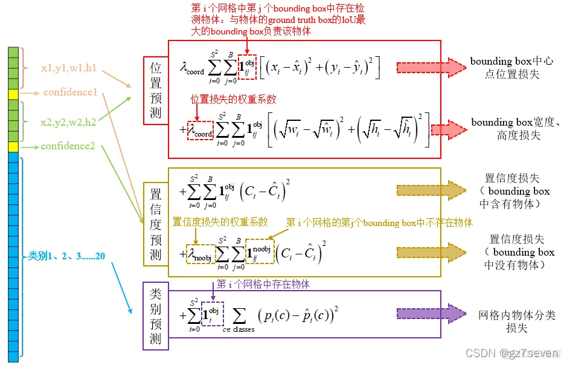

## 基本概念

### 什么是目标检测

目标检测（Object Detection）的任务是找出图像中所有感兴趣的目标（物体），确定它们的类别和位置，是计算机视觉领域的核心问题之一。由于各类物体有不同的外观、形状和姿态，加上成像时光照、遮挡等因素的干扰，目标检测一直是计算机视觉领域最具有挑战性的问题。

计算机视觉中关于图像识别有四大类任务：

- **分类（Classification）**：解决“是什么？”的问题，即判断给定图像或视频中包含什么类别的目标。
- **定位（Localization）**：解决“在哪里？”的问题，即定位目标的位置。
- **检测（Detection）**：同时解决“是什么？”和“在哪里？”的问题，即确定目标的类别与位置。
- **分割（Segmentation）**：包括语义分割（Semantic Segmentation）与实例分割（Instance Segmentation），解决每个像素属于哪个类别或对象实例的问题。

### 目标检测要解决的核心问题

除了图像分类之外，目标检测要解决的核心问题是：

1. 目标可能出现在图像的任何位置。
2. 目标有各种不同的大小。
3. 目标可能有各种不同的形状。

### 目标检测算法分类

#### Two-stage 目标检测算法

首先生成可能包含待检测物体的候选区域（Region Proposal，RP），再通过卷积神经网络对候选区域进行分类与边界框回归。

任务：

1. 特征提取。
2. 生成候选区域。
3. 对候选区域进行分类。
4. 对候选区域进行位置回归，得到最终边界框。

常见的 Two-stage 目标检测算法包括：

- R-CNN
- SPP-Net
- Fast R-CNN
- Faster R-CNN
- R-FCN

#### One-stage 目标检测算法

不显式生成候选区域，而是直接在网络中提取特征并预测目标类别与位置。

任务：

1. 特征提取。
2. 对预测框分类。
3. 对预测框定位回归得到最终的边界框。

常见的 One-stage 目标检测算法包括：

- OverFeat
- YOLO
- SSD
- RetinaNet
- DETR


_图 1：常见目标检测算法的发展脉络。_

## Two-stage 目标检测算法

### Faster R-CNN

Faster R-CNN 是在 R-CNN、SPP-Net 和 Fast R-CNN 的基础上发展而来的。

**R-CNN** 是 R-CNN 系列的第一代算法，将深度学习与传统计算机视觉方法相结合：使用 Selective Search 提取候选区域，使用 CNN 提取区域特征，再通过 SVM 完成分类。

**Fast R-CNN** 基于 R-CNN 和 SPP-Net 进行改进。SPP-Net 的关键创新是先计算整幅图像的共享特征图，再将候选区域映射到共享特征图上，从而避免重复计算卷积特征。不过，SPP-Net 仍采用多阶段训练流程，并需要将特征保存到本地磁盘。Fast R-CNN 将分类和边界框回归整合进同一网络，但仍依赖 Selective Search 等外部候选区域生成方法；在原论文的测试中，生成约 2,000 个候选区域就需要约 2 秒。

**Faster R-CNN** 使用区域候选网络（Region Proposal Network，RPN）代替外部候选区域生成方法。RPN 与检测网络共享卷积特征，使候选区域生成更加高效，并让整体检测流程更接近端到端训练。


_图 2：Faster R-CNN 的整体流程与网络结构。_

#### 区域候选网络（RPN）

区域候选网络（Region Proposal Network，RPN）以主干网络输出的特征图为输入，先应用一个 $3 \times 3$ 卷积，再使用两个 $1 \times 1$ 卷积分支分别执行前景/背景二分类和边界框回归。

假设特征图上的每个位置对应 9 个 Anchor，则分类分支输出 $9 \times 2$ 个通道，回归分支输出 $9 \times 4$ 个通道。RPN 是一个全卷积网络（Fully Convolutional Network，FCN），因此可以处理不同尺寸的输入图像。

RPN 完成：

- 前景/背景分类。
- 边界框坐标回归。


_图 3：RPN 的分类与边界框回归分支。_

RPN 引入了 Anchor 机制。以步长为 16 的主干网络为例，特征图上的一个位置大致对应原图中的一个 $16 \times 16$ 区域。一组 Anchor 坐标示例如下：

```text
[[ -84.  -40.   99.   55.]
 [-176.  -88.  191.  103.]
 [-360. -184.  375.  199.]
 [ -56.  -56.   71.   71.]
 [-120. -120.  135.  135.]
 [-248. -248.  263.  263.]
 [ -36.  -80.   51.   95.]
 [ -80. -168.   95.  183.]
 [-168. -344.  183.  359.]]
```

每行的 4 个值 $(x_1, y_1, x_2, y_2)$ 分别表示矩形左上角和右下角的坐标。这 9 个 Anchor 通常由 3 种尺度和 3 种宽高比组合而成，近似宽高比为 $\{1:1, 1:2, 2:1\}$。Anchor 机制由此引入了目标检测中常用的多尺度设计。


_图 4：不同尺度与宽高比的 Anchor。_

RPN 会在整张图像上密集设置 Anchor，再判断每个 Anchor 属于前景还是背景，并对前景 Anchor 的位置进行回归修正。

例如，输入图像尺寸为 $800 \times 600$，VGG 主干网络[下采样](https://zhida.zhihu.com/search?q=%E4%B8%8B%E9%87%87%E6%A0%B7&zhida_source=entity&is_preview=1) 16 倍，且特征图的每个位置设置 9 个 Anchor，则 Anchor 总数约为：

$$
\left\lceil \frac{800}{16} \right\rceil
\times
\left\lceil \frac{600}{16} \right\rceil
\times 9
= 17{,}100
$$


_图 5：RPN 训练及候选区域生成过程。_

接下来，RPN 会通过 GT Bounding Box 和 IoU 去挑选一些正例和反例 Anchor 进行训练，来分类和回归位置。RPN 网络在自身训练的同时，还会由 Proposal Layer 层产生 RoIs（Region of Interests）给 Fast R-CNN（RoI Head）作为训练样本。RPN 生成 RoIs 的过程（Proposal Creator）如下：

1. 根据特征图计算各 Anchor 属于前景的概率及其位置回归参数，并选择前景概率较高的 Anchor。
2. 利用回归参数修正 Anchor 的位置，得到候选 RoI。
3. 使用非极大值抑制（Non-Maximum Suppression，NMS）筛选最终的 RoI。

##### RPN 小结

RPN 网络结构：

- 生成 Anchors。
- 使用分类分支筛选正 Anchor。
- 使用边界框回归分支修正正 Anchor。
- 通过 Proposal Layer 生成候选区域。

RPN 最终输出 RoIs（Region of Interests）。

#### RoI Head

RoI Head 基于 RPN 输出的 RoI 继续进行多类别分类与边界框回归，主要包括：

- RoI Pooling
- 全连接层
- 分类与边界框回归分支

由于 RPN 输出的 RoI 对应特征图上大小不同的区域，因此需要使用 RoI Pooling 将其转换为统一尺寸，再送入后续全连接层，分别完成类别分类与边界框回归。

推荐阅读：[RoI Pooling 与 RoI Align 的区别](https://www.cvmart.net/community/detail/3411)。

#### Faster R-CNN 总结

训练时，图像经过 CNN 主干网络得到特征图；RPN 根据特征图和标注信息对 Anchor 进行前景/背景分类与位置回归，并输出 RoI；RoI Head 再结合特征图、RoI 和标注信息，预测 RoI 所属的 $N+1$ 个类别（包含背景类），并进一步修正边界框。RPN 与 RoI Head 的分类损失和回归损失共同构成最终损失，通过反向传播更新模型参数。

## One-stage 目标检测算法

### YOLO（You Only Look Once）

> 本节仅介绍 YOLOv1。后续版本可参考：[目标检测](https://github.com/scutan90/DeepLearning-500-questions/blob/master/ch08_%E7%9B%AE%E6%A0%87%E6%A3%80%E6%B5%8B/%E7%AC%AC%E5%85%AB%E7%AB%A0_%E7%9B%AE%E6%A0%87%E6%A3%80%E6%B5%8B.md)。

YOLO 将目标检测建模为回归问题，使用单个端到端（End-to-End）网络直接从输入图像预测目标的位置与类别。YOLO 与 Faster R-CNN 的主要区别如下：

- YOLO 在单个网络中完成训练与检测，不显式生成候选区域；Faster R-CNN 则使用 RPN 生成候选区域，再由 RoI Head 完成检测。
- YOLO 通过一次前向推理直接输出图像中目标的位置、类别与置信度；Faster R-CNN 则通过候选区域生成和区域级检测两个阶段完成预测。


_图 6：YOLOv1 检测流程。_

YOLOv1 将输入图像划分为 $7 \times 7 = 49$ 个网格，每个网格预测 2 个边界框，因此共输出 $49 \times 2 = 98$ 个边界框。与显式生成候选区域不同，这些预测由规则网格直接产生并覆盖整幅图像。

这种设计省去了基于搜索的候选区域生成过程，并将边界框预测直接整合进网络，因此能够获得较高的检测速度。


_图 7：YOLOv1 的网格划分与目标分配。_

#### 网络结构

YOLOv1 由卷积层、池化层和两层全连接层构成。对于边界框数值预测，输出层使用线性激活。尺寸为 $448 \times 448 \times 3$ 的输入图像经过网络后，得到 $7 \times 7 \times 30$ 的输出张量。


_图 8：YOLOv1 网络结构。_

每个网格输出的 30 维向量由以下部分组成：

- 20 个类别条件概率 $P(C_i \mid \mathrm{Object})$；
- 2 个边界框的坐标，每个边界框表示为 $(x, y, w, h)$，共 8 个值；
- 2 个边界框置信度。

边界框置信度定义为：

$$
\mathrm{Confidence}
= \Pr(\mathrm{Object})
\times \mathrm{IoU}_{\mathrm{pred}}^{\mathrm{truth}}
$$

该值同时反映边界框内是否存在目标，以及预测框与真实框的重叠程度。推理阶段没有真实框可供参考，模型直接输出训练后学到的置信度预测。

YOLOv1 使用一个多任务平方误差损失函数，综合计算边界框中心、宽高、置信度与分类误差：

$$
\begin{aligned}
\mathcal{L} ={}&
\lambda_{\mathrm{coord}}
\sum_{i=0}^{S^2}\sum_{j=0}^{B}
\mathbb{1}_{ij}^{\mathrm{obj}}
\left[(x_i-\hat{x}_i)^2+(y_i-\hat{y}_i)^2\right] \\
&+ \lambda_{\mathrm{coord}}
\sum_{i=0}^{S^2}\sum_{j=0}^{B}
\mathbb{1}_{ij}^{\mathrm{obj}}
\left[(\sqrt{w_i}-\sqrt{\hat{w}_i})^2+(\sqrt{h_i}-\sqrt{\hat{h}_i})^2\right] \\
&+ \sum_{i=0}^{S^2}\sum_{j=0}^{B}
\mathbb{1}_{ij}^{\mathrm{obj}}(C_i-\hat{C}_i)^2 \\
&+ \lambda_{\mathrm{noobj}}
\sum_{i=0}^{S^2}\sum_{j=0}^{B}
\mathbb{1}_{ij}^{\mathrm{noobj}}(C_i-\hat{C}_i)^2 \\
&+ \sum_{i=0}^{S^2}
\mathbb{1}_{i}^{\mathrm{obj}}
\sum_{c \in \mathrm{classes}}(p_i(c)-\hat{p}_i(c))^2
\end{aligned}
$$

其中，$\mathbb{1}_{i}^{\mathrm{obj}}$ 表示网格 $i$ 中存在目标，$\mathbb{1}_{ij}^{\mathrm{obj}}$ 表示网格 $i$ 的第 $j$ 个边界框负责预测该目标，$\mathbb{1}_{ij}^{\mathrm{noobj}}$ 表示该边界框不负责预测目标。$\lambda_{\mathrm{coord}}$ 用于提高边界框坐标误差的权重，YOLOv1 将其设为 5。



_图 9：YOLOv1 损失函数的组成。_

训练完成后，YOLOv1 输出 49 个 30 维向量，表示各网格的类别概率、边界框位置和置信度。为从这些预测中筛选最终结果，YOLOv1 使用非极大值抑制（NMS）。

NMS 的核心过程是：选择分数最高的预测框作为输出，删除与其高度重叠的同类别预测框，并反复迭代，直到处理完所有候选框。YOLOv1 中每个类别与边界框组合的分数为：

$$
\mathrm{Score}_{ij}
= P(C_i \mid \mathrm{Object})
\times \mathrm{Confidence}_j
$$


_图 10：非极大值抑制的处理步骤。_

#### YOLO 总结

YOLO 的端到端训练方式和直接回归边界框的设计，为实时目标检测提供了重要思路。与 R-CNN 系列的二阶段流程相比，YOLO 使用单阶段网络同时预测类别与位置，在保持流程简洁的同时显著提升了推理速度。

### DETR（Detection Transformer）

DETR 是 Facebook AI Research 在 ECCV 2020 上提出的、基于 Transformer 的端到端目标检测网络。其主要特点包括：

- 不需要预定义 Anchor；
- 不需要 NMS 等后处理。

原始 DETR 在大目标检测上表现较好，但对小目标的检测能力相对较弱；基于二分匹配的训练方式也带来了收敛速度较慢的问题。

DETR 首先使用 CNN 提取图像特征，再将特征送入 Transformer Encoder–Decoder，最后预测类别和边界框，并通过二分图匹配确定预测结果与真实目标之间的对应关系。

#### 网络结构


_图 11：DETR 的网络结构与检测流程。_

##### Backbone

Backbone 是用于提取图像特征的 CNN 网络，例如 ResNet-50。其输出特征图经过 $1 \times 1$ 卷积降维后，展开为空间特征序列并送入 Transformer。

##### Position Embedding

CNN 输出的特征不显式包含空间位置信息，而目标检测需要预测边界框位置，因此 DETR 需要加入位置编码（Position Embedding）。

Embedding 操作将输入映射为向量表示，可以分为两部分：

- **Input Embedding**：将输入映射为连续向量。例如，在 NLP 中将 Token 映射为向量；在计算机视觉中可将像素或图像块（Patch）映射为向量。
- **Positional Encoding**：使用与 Input Embedding 维度相同的向量提供位置信息，例如形状为 $[N, HW, C]$ 的二维位置编码。

DETR 在 Encoder 和 Decoder 的注意力计算中重复加入空间位置编码；Decoder 还使用可学习的 Object Query 编码来区分不同的预测槽位。

##### Transformer Encoder

Transformer Encoder 由多个编码模块组成，每个模块主要包含：

- Multi-Head Self-Attention
- 残差连接
- 层归一化
- FFN
- 残差连接
- 层归一化

##### Transformer Decoder

Transformer Decoder 由多个解码模块组成，每个模块主要包含：

- Multi-Head Self-Attention
- 残差连接
- 层归一化
- Cross Multi-Head Attention
- 残差连接
- 层归一化
- FFN
- 残差连接
- 层归一化

##### Prediction Head

Prediction Head 作用于 Decoder 对各 Object Query 的输出，并在所有查询之间共享参数。类别预测使用线性层，边界框预测使用带 ReLU 激活的三层 MLP。每个 Query 最终输出一个类别分布和一个归一化边界框。

#### Object Query

Object Query 是一组可学习的查询向量。原始 DETR 默认使用 100 个 Query，因此最多输出 100 个检测结果。Decoder 使用这些 Query 从 Encoder 特征中聚合与不同目标相关的信息，每个 Query 对应一个预测槽位（Slot），最终产生一个类别和边界框预测。

Object Query 并不是预设的 Anchor，也不直接表示固定位置的检测框；其语义与关注区域由训练过程共同学习。

#### Set Prediction

DETR 将目标检测建模为集合预测（Set Prediction）问题，直接输出类别概率与归一化边界框的集合。由于模型学习的是无序目标集合，因此无需预设 Anchor 的尺度和宽高比，也不需要使用 NMS 去除重复预测。

原始 DETR 预测固定大小的 $N=100$ 个结果，通常多于图像中的实际目标数量。为了确定预测结果与真实目标之间的对应关系，DETR 使用一个特殊的“无目标”类别 $\varnothing$ 补齐真实集合，再通过匈牙利算法执行二分图匹配，使总匹配代价最小：

$$
\hat{\sigma}
= \underset{\sigma \in \mathfrak{S}_N}{\arg\min}
\sum_{i=1}^{N}
\mathcal{L}_{\mathrm{match}}(y_i, \hat{y}_{\sigma(i)})
$$

$$
\mathcal{L}_{\mathrm{match}}(y_i, \hat{y}_{\sigma(i)})
= -\mathbb{1}_{\{c_i \ne \varnothing\}}
\hat{p}_{\sigma(i)}(c_i)
+ \mathbb{1}_{\{c_i \ne \varnothing\}}
\mathcal{L}_{\mathrm{box}}(b_i, \hat{b}_{\sigma(i)})
$$

匹配代价同时考虑类别预测与边界框误差，因此匹配结果需要在类别一致性和位置接近程度之间取得平衡。

完成匹配后，使用负对数似然分类损失与边界框损失训练模型。边界框损失由 L1 损失和广义交并比（Generalized IoU，GIoU）损失加权组成：

$$
\mathcal{L}_{\mathrm{Hungarian}}(y, \hat{y})
= \sum_{i=1}^{N}
\left[
-\log \hat{p}_{\hat{\sigma}(i)}(c_i)
+ \mathbb{1}_{\{c_i \ne \varnothing\}}
\mathcal{L}_{\mathrm{box}}(b_i, \hat{b}_{\hat{\sigma}(i)})
\right]
$$

$$
\mathcal{L}_{\mathrm{box}}(b_i, \hat{b}_{\sigma(i)})
= \lambda_{\mathrm{GIoU}}\mathcal{L}_{\mathrm{GIoU}}(b_i, \hat{b}_{\sigma(i)})
+ \lambda_{L_1}\lVert b_i-\hat{b}_{\sigma(i)}\rVert_1
$$

由于“无目标”类别远多于真实目标，训练时会降低该类别对应的分类损失权重，以缓解类别不平衡。

#### DETR 总结

DETR 将目标检测转化为集合预测问题，以端到端方式直接输出类别与边界框集合，去除了 Anchor 和 NMS 等人工设计。随后出现的 Deformable DETR、Anchor DETR 和 RT-DETR 等方法，分别从收敛速度、小目标检测与实时性等方面扩展了这一范式。

## 参考资料

- [目标检测](https://github.com/scutan90/DeepLearning-500-questions/blob/master/ch08_%E7%9B%AE%E6%A0%87%E6%A3%80%E6%B5%8B/%E7%AC%AC%E5%85%AB%E7%AB%A0_%E7%9B%AE%E6%A0%87%E6%A3%80%E6%B5%8B.md)
- [二阶段目标检测网络——Faster R-CNN 详解](https://www.cnblogs.com/armcvai/p/16985899.html)
- [YOLO 详解](https://zhuanlan.zhihu.com/p/25236464)
- [YOLO 算法](https://github.com/luanshiyinyang/YOLO)
- [DETR：End-to-End Object Detection with Transformers](https://arxiv.org/abs/2005.12872)
- [DETR Family for End-to-End Detection](https://zeqiang-lai.github.io/blog/posts/ai/detr/)
- [论文解读：DETR 《End-to-end object detection with transformers》，ECCV 2020](https://blog.csdn.net/weixin_43959709/article/details/115708159)
